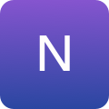

<!-- PROJECT SHIELDS -->
[![Build Status][build-shield]]()
[![Contributors][contributors-shield]]()
[![MIT License][license-shield]][license-url]

<!-- PROJECT LOGO -->
<br />
<p align="center">
  <a href="https://github.com/a01334390/noor">
    
  </a>

  <h3 align="center">Noor</h3>

  <p align="center">
    My personal portfolio website
    <br />
    <a href="https://github.com/a01334390/noor"><strong>Explore the docs »</strong></a>
    <br />
    <br />
    <a href="https://github.com/a01334390/noor">View Demo</a>
    ·
    <a href="https://github.com/a01334390/noor/issues">Report Bug</a>
    ·
    <a href="https://github.com/a01334390/noor/issues">Request Feature</a>
  </p>
</p>


<!-- TABLE OF CONTENTS -->
## Table of Contents

* [About the Project](#about-the-project)
  * [Built With](#built-with)
* [Getting Started](#getting-started)
  * [Prerequisites](#prerequisites)
  * [Installation](#installation)
* [Usage](#usage)
* [Contributing](#contributing)
* [License](#license)
* [Contact](#contact)
* [Acknowledgements](#acknowledgements)


<!-- ABOUT THE PROJECT -->
## About The Project

[![Product Name Screen Shot][product-screenshot]](http://martntn.com)

This portfolio was built to showcase my most recent school projects, work projects, and passion projects to the people who were interested in checking them out. This portfolio, in its final version, should allow me to:

* Show the projects I've worked on, its development process, and some screenshots.
* Use it as a living, dynamic curriculum to apply to multiple companies.
* Allow me to experiment with new technologies.

At this moment, this website is really simple (I had to build it in 3 days), but it's scheduled to include by July 2019:
* Federated Login (Facbook)
* DynamoDB connection using AppSync
* A real dynamic interface
* AWS SES to keep in touch with my clients
* And more...

### Built With
This application was built using the following frameworks:

* [Bootstrap](https://getbootstrap.com)
* [JQuery](https://jquery.com)
* [NodeJS](https://nodejs.org/en/)
* [MongoDB](https://www.mongodb.com)

<!-- GETTING STARTED -->
## Getting Started

This is a personal project and I doubt people would actually want to download it for their personal use. However, if you'd still like to, these are the following steps to check it out.

### Prerequisites

This is an example of how to list things you need to use the software and how to install them.
* npm
```sh
npm i npm -g
```

### Installation

1. Get a Database Address and key at[Mongolab](https://mlab.com)
2. Clone the repo
```sh
git clone https://github.com/a01334390/Noor.git
```
3. Install NPM packages
```sh
npm install
```
4. Enter your API in `config.js`
```JS
const API_KEY = 'ENTER YOUR API';
```

<!-- CONTRIBUTING -->
## Contributing

Contributions are what make the open source community such an amazing place to be learn, inspire, and create. Any contributions you make are **greatly appreciated**.

1. Fork the Project
2. Create your Feature Branch (`git checkout -b feature/AmazingFeature`)
3. Commit your Changes (`git commit -m 'Add some AmazingFeature`)
4. Push to the Branch (`git push origin feature/AmazingFeature`)
5. Open a Pull Request


<!-- LICENSE -->
## License

Distributed under the MIT License. See `LICENSE` for more information.

<!-- CONTACT -->
## Contact

Fernando Martin Garcia Del Angel - [martntn](https://www.linkedin.com/in/martntn/) - martingarciadelangel@me.com

Project Link: [https://github.com/a01334390/Noor](https://github.com/a01334390/Noor)


<!-- ACKNOWLEDGEMENTS -->
## Acknowledgements
* [GitHub Emoji Cheat Sheet](https://www.webpagefx.com/tools/emoji-cheat-sheet)
* [Img Shields](https://shields.io)
* [Choose an Open Source License](https://choosealicense.com)
* [GitHub Pages](https://pages.github.com)
* [Animate.css](https://daneden.github.io/animate.css)
* [Loaders.css](https://connoratherton.com/loaders)
* [Slick Carousel](https://kenwheeler.github.io/slick)
* [Smooth Scroll](https://github.com/cferdinandi/smooth-scroll)
* [Sticky Kit](http://leafo.net/sticky-kit)
* [JVectorMap](http://jvectormap.com)
* [Font Awesome](https://fontawesome.com)


<!-- MARKDOWN LINKS & IMAGES -->
[build-shield]: https://img.shields.io/badge/build-passing-brightgreen.svg?style=flat-square
[contributors-shield]: https://img.shields.io/badge/contributors-1-orange.svg?style=flat-square
[license-shield]: https://img.shields.io/badge/license-MIT-blue.svg?style=flat-square
[license-url]: https://choosealicense.com/licenses/mit
[linkedin-shield]: https://img.shields.io/badge/-LinkedIn-black.svg?style=flat-square&logo=linkedin&colorB=555
[linkedin-url]: https://linkedin.com/in/othneildrew
[product-screenshot]: https://raw.githubusercontent.com/othneildrew/Best-README-Template/master/screenshot.png
